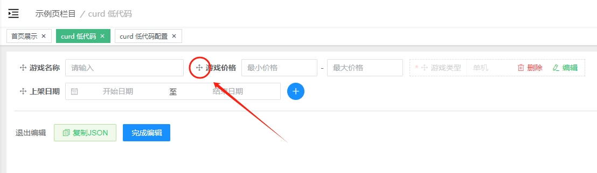
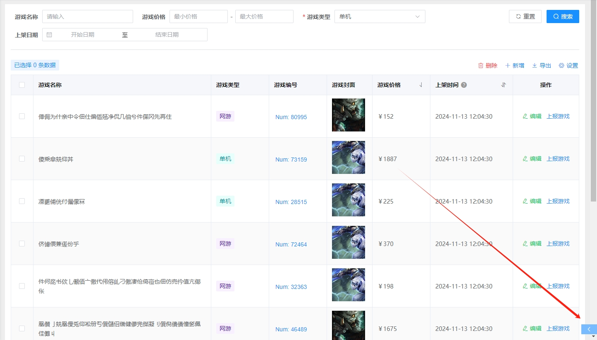

# 低代码配置组件

- [配置页演示](https://travis-hjs.github.io/vue-admin-el/#/example/curd)

- [空配置页演示](https://travis-hjs.github.io/vue-admin-el/#/example/curd-config)

核心功能清单及描述：

| 功能 | 描述 |
| --- | --- |
| 增、删、改、查 | 通用形核心功能，表格数据条件查询、表格多选操作、表格行数据操作、自定义按钮功能操作 |
| 搜索条件配置 | 可配置条件字段、规则、数据等组合式筛选功能 |
| 表格配置 | 可配置展示类型、展示规则、动态代码、表格操作功能 |
| 表单配置及验证 | 可配置条件字段、规则、数据、展示逻辑代码等组合式功能表单 |
| 自定义代码配置(特色) | 可配置`javascript`动态代码片段功能，有了该功能的支持，加上内部暴露的方法，可以自由地实现各种逻辑功能，跳出传统程序设计的限制。 |

以上功能都通过`可视化配置`或`代码配置`完成，灵活度极高，上手难度低；在使用可视化配置中，只需要使用者稍微掌握一点`javascript`语言的使用就可以轻松实现各种逻辑功能，可配合服务端存储配置处理成各种动态页面。

当前程序设计基于以下功能组件

- [搜索组件](../FilterBox/README.md)
- [通用表格组件](../Table/README.md)

进行`功能设计` + `配置数据结构`然后组合起来实现，代码耦合度极低，每一个功能或组件都是可以单独抽离使用，并且不依赖除 [Element-plus UI](https://element-plus.org/zh-CN/) 外的任何第三方库。

## 数据结构的设计

组件中需要传入两个属性，数据配置`data`和功能方法配置`action`，在 [types.ts](./src/types.ts) 中可以看到详细的注解；

当前的可视化操作围绕`data`的结构进行逐个细分配置和处理，所以支持两种配置使用方式：**可视化配置**和**代码配置**，下面一一介绍。

> 代码配置中，注意看 jsDoc 的注解提示，有些特殊字段会说明原因

```html
<script lang="ts" setup>
import { getTableList, saveForm, setReport } from "@/api/common";
import { Curd, type CurdType } from "@/components/Curd";
import { reactive } from "vue";

const data = reactive<CurdType.Config>({
  search: {
    labelRight: false,
    labelWidth: undefined,
    list: [],
  },
  table: {
    columns: [],
    actions: [],
    batchs: [],
    operations: [],
    selectKey: undefined,
    formAdd: undefined,
    formEdit: undefined,
  }
});

const action: CurdType.Action = {
  getTableData(searchInfo, pageInfo) {
    // console.log("searchInfo >>", searchInfo);
    return getTableList({...searchInfo, ...pageInfo});
  },
  created(getData) {
    // console.log("curd created");
    getData();
  },
  onAdd(form, current) {
    // console.log("onAdd >>", form, current);
    return saveForm(current);
  },
  onEdit(form, current) {
    // console.log("onEdit >>", form, current);
    return saveForm(form);
  },
}
</script>
<template>
  <Curd :data="data" :action="action" />
</template>
```

## 使用说明-可视化配置
  
**注意**，在编辑模式下，带有该图标的全部为可拖拽操作。



**配置入口**为右下角箭头处



页面按钮操作总共分为3类，分别对应：`actions`、`batchs`、`operations`字段，对照图：


因为新增和编辑用的频率比较高，所以单独提取到最外边的配置入口，同时在保存时提供了同步表单项的功能，也是方便使用


每个按钮都可以单独配置点击事件（直接写js），包括可以接收不同按钮点击的传参字段，所以理论上可以实现任意功能；内置的预设代码示例可以拓展为接口提供，这样可以单独管理按钮的代码片段，实现实时修改和高拓展场景。


### 表单项组件的配置

> **搜索条件** 和 **表单配置** 均使用该功能

当前在数据结构的定义中区分了不同组件的所需数据结构，所以在编辑时有步骤的先后顺序，选取对应的组件之后会呈现差异化的配置表单，部分相同字段位置不变。


在配置不同的组件时，可以自由地配置对应的默认值和绑定的数据，当然，也可以由接口请求获取数据再做字段的填充，两者是等价的；在搜索【重置】时，会恢复为默认值；默认值在选取组件时会自动设置为对应类型的值，不设置就是空的处理。

需要注意的是：组件默认值的设置为`JSON`字段，`value: xxx`中的`xxx`就是要设置的默认值。


组件的配置中，**日期组件** 的默认值配置需要特殊处理，将不再支持手动输入`JSON`的方式，而是使用预设的快捷日期选项；因为日期的值比较特殊，而且格式化的配置以及日期类型比较复杂，全部开放给使用者手动填写会有可能写错，所以为了更好的容错率使用，这里设计成只保留必须的输入操作，并且提供了多种日期类型的设置。


表单项条件显示的 **动态代码配置**：这里输入的就是`javascript`代码片段了，可以自由根据表单的动态值做逻辑处理，注意必须要有`return`关键字，内部做了字符串的判断处理，没有`return`则不做代码解析处理。

示例：

```js
if (formData.type === 1) {
  return false;
}
if (formData.price > 20 && formData.goodsType === 2) {
  return false;
}
return true;
```

注意，当前代码片段的`formData`不是响应式数据，而是函数传参，所以修改`formData`的值对界面数据来说是无效的，像这样：

```js
if (formData.type === 1) {
  formData.id = 2;  // 这里无法修改当前表单的绑定值
  return false;
}
// ...do some
```


### 表格列配置

> 表格列中，分两个功能配置：**展示列** 和 **操作列**

因为操作列中为固定靠右、永远处于数组最后一项、并且只渲染按钮操作组件，所以需要分开去配置，这样在配置的表单中会更加清晰明确。


配置列的时候，会校验 **表格列键值** 字段的唯一性，所以无效担心重复的情况；并且支持`3`种展示类型，具体的展示通过预览区域可以看到。


这里需要详细说明的是 **自定义js代码** 选项，选择该配置之后将应用代码片段去做渲染处理，例如：

```js
if (row.type === 2) {
  return `${cellValue} 个`;
}
return `${cellValue} 条`; 
```

还可以渲染任意的`HTML`及方法的调用。

```js
console.log("table cell >>", row, cellValue);
return `<button class="el-button" onclick="_copyText(${row.id})">复制ID</button>`;
```

`_copyText`方法为项目中自定义约定好的暴露给外部使用的方法，当然，`return`关键字是必须的，不要忘记了。暴露的使用方式在下面具体说明。


注意！！！页面方法不能直接抛出到全局，因为会存在多个低代码配置页，所以程序中实现需要隔离开来；使用时需要用页面标识来调用对应配置页的方法：

```js
// 当前页面/菜单标识
const pageId = "_pageId";
// 当前页面功能对象
const page = window[`_${pageId}`];

// 调用当前页面的方法
page.setLoading(true);
page.onSearch();
page.getSearchParams();
```

### 操作列配置

相信看到这里你已经非常清晰了，按钮的每一个属性都可以通过自定义代码的输入方式进行配置，除了 **按钮功能代码** 外，其他的配置全部以`return`关键字为判定解析代码处理。

### 自定义暴露的全局方法

在组件目录中有导出一个叫`exportPropToWindow`的方法，该方法会将属性设置到`window`上，所以在自定义代码片段中才能够调用，设置到`window`上的方法全部以`_`(下划线)开头。有些特殊操作需要自定义页面或者复杂功能时，可以在代码中封装一个方法直接给外部调用，这样就可以实现任意功能，例如：

> 当前已经暴露的属性请看 [index.vue](./src/index.vue) 文件。

```ts
/**
 * 获取数据，并打开自定义弹框组件，例如编辑复杂的功能处理、图表、富文本编辑器、上传图片等
 * @params id 
 */
async function onCustom(id: number) {
  state.loading = true;
  const res = await getData(id)
  state.loading = false;
  if (res.code === 1) {
    // do some...
  }
}

exportPropToWindow({
  // 省略其他代码...
  [props.pageId]: {
    // 省略其他代码...
    onCustom, // 这里为页面的方法，所以要放在 props.pageId 对象内
  }
});
```

> 这些对外暴露的方法应该写在哪里？

如果是通用功能，可以写在`<Crud />`组件目录里面，如果是单独定制，那就写在使用`<Crud />`组件的同级文件中。

### 保存配置

复制的`JSON`配置可以直接粘贴到`<Curd :data="config" />`绑定的值`config`中，可视化配置的数据结构和手动配置是等价的。

完成编辑则应用当前修改并返回到使用页。


## 使用说明-代码配置

- 数据结构请看 [CurdType](./src/types.ts) 类型声明及注释，有详细说明

注意在手动配置数据时，务必使用`getColumnData`、`getFieldData`去组装数据，确保数据齐全的可靠性，同时可以少写一些代码，更多对外导出的方法看 [index.ts](./index.ts)

在设计数据结构时，为了更好的区分数据结构和类型检查，这里每一个表单项对象`Field`都是不同的属性，所以在使用时，要先输入`type: xxx`的类型，之后才会做对应的类型检查，在`getFieldData`方法中第一个参数就是`type`，传入对应的组件类型时就能获取对应的返回类型。

```html
<template>
  <Curd v-model:data="data" :action="action" :pageId="pageId" />
</template>
<script lang="ts" setup>
import { getTableList, saveForm, setReport } from "@/api/common";
import {
  Curd,
  getColumnData,
  getFieldData,
  type CurdType,
  CurdEnum,
} from "@/components/Curd";
import { TableEnum } from "@/components/Table";
import { formatDate } from "@/utils";
import { message, messageBox } from "@/utils/message";
import { ref } from "vue";
import { useRoute } from "vue-router";

const route = useRoute();

const pageId = route.name as string;

const option = {
  gameType: [
    { label: "单机", value: 1 },
    { label: "网游", value: 2 },
  ]
}

const data = ref<CurdType.Config>({
  search: {
    labelRight: false,
    labelWidth: undefined,
    list: [
      {
        ...getFieldData("input", "gameName"),
        label: "游戏名称"
      },
      {
        ...getFieldData("input-between", "gamePrice"),
        label: "游戏价格",
        placeholder: ["最小价格", "最大价格"],
        valueType: "array<number>",
        valueWidth: 300
      },
      {
        ...getFieldData("select", "gameType"),
        label: "游戏类型",
        placeholder: "请选择游戏类型",
        options: option.gameType,
        required: true,
        defaultValue: 1,
      },
      {
        ...getFieldData("date", "gameDate"),
        label: "上架日期",
        dateType: "daterange",
        formatShow: "YYYY-MM-DD HH:mm:ss",
        format: "Y-M-D h:m:s",
        valueType: "array",
        valueWidth: 400
      }
    ],
  },
  table: {
    columns: [
      {
        ...getColumnData("gameName", "游戏名称"),
        minWidth: 140,
      },
      {
        ...getColumnData("gameType", "游戏类型"),
        width: 140,
        rawContent(cellValue) {
          const map = {
            1: {
              color: "cyan",
              text: "单机"
            },
            2: {
              color: "purple",
              text: "网游"
            }
          }
          const key = cellValue as keyof typeof map;
          const val = map[key];
          return `<span class="the-tag ${val.color}">${val.text}</span>`
        }
      },
      {
        ...getColumnData("num", "游戏编号"),
        width: 140,
        cellType: "js",
        tooltip: false,
        jsCode: 'return `<button type="button" class="el-button el-button--primary is-link" onclick="_copyText(${cellValue}, () => _message.success(\'复制成功\'))"><span>Num: ${cellValue}</span></button>`;',
        slot: "render-cell-num",
      },
      {
        ...getColumnData("banner", "游戏封面"),
        width: 110,
        cellType: "image",
        slot: "preview-image-banner",
      },
      {
        ...getColumnData("gamePrice", "游戏价格"),
        width: 140,
        formatter(row, cellValue) {
          return cellValue ? `￥${cellValue}` : "-";
        },
        sort: "desc",
      },
      {
        ...getColumnData("date", "上架时间"),
        width: 200,
        formatter(row, cellValue) {
          return cellValue ? formatDate(cellValue) : "-";
        },
        sort: true,
        titleTips: "人工设置的时间"
      },
      {
        ...getColumnData(TableEnum.Right, "操作"),
        width: 220,
      },
    ],
    actions: [
      {
        key: CurdEnum.ActionEdit,
        text: "编辑",
        type: "success",
        icon: "el-icon-edit"
      },
      {
        key: "1",
        text: row => row.report === 1 ? "上报游戏" : "取消上报",
        type: "primary",
        click(row, index) {
          console.log("上报游戏 >>", row, index);
          const name = row.report === 1 ? "上报游戏" : "取消上报";
          messageBox({
            content: `是否${name}？`,
            cancelText: "取消",
            async confirm() {
              const res = await setReport(row.report);
              row.report = res.data;
              message.success(`${name}成功~`);
            },
          });
        },
      },
      {
        key: "2",
        text: "同步数据",
        type: "primary",
        click: `const pageId = "${pageId}";
const page = window[\`_\${pageId}\`];
_messageBox({
  title: "操作提示",
  content: \`是否同步【\${row.gameName}】数据？\`,
  cancelText: "取消",
  confirm() {
    _message.success("同步数据成功！");
    page.getData();
  }
});`,
      }
    ],
    formAdd: {
      width: 520,
      labelPosition: "left",
      labelWidth: 140,
      fields: [
        {
          ...getFieldData("input", "gameName"),
          label: "游戏名称",
          required: true,
          placeholder: "请输入游戏名称",
        },
        {
          ...getFieldData("select", "gameType"),
          label: "游戏类型",
          required: true,
          placeholder: "请选择游戏类型",
          valueType: "number",
          options: option.gameType
        },
        {
          ...getFieldData("input", "gamePrice"),
          label: "游戏价格",
          required: true,
          placeholder: "请输入游戏价格",
          valueType: "number",
        },
        {
          ...getFieldData("date", "gameDate"),
          label: "上架日期"
        },
        {
          ...getFieldData("switch", "gameLimit"),
          label: "设备登录限制",
          show(formData) {
            // console.log("formData >>", formData);
            return formData.gameType === 2;
          },
        }
      ]
    },
    formEdit: {
      width: 520,
      labelPosition: "left",
      labelWidth: 140,
      fields: [
        {
          ...getFieldData("input", "gameName"),
          label: "游戏名称",
          required: true,
          placeholder: "请输入游戏名称",
        },
        {
          ...getFieldData("select", "gameType"),
          label: "游戏类型",
          required: true,
          placeholder: "请选择游戏类型",
          valueType: "number",
          options: option.gameType
        },
        {
          ...getFieldData("input", "gamePrice"),
          label: "游戏价格",
          required: true,
          placeholder: "请输入游戏价格",
          valueType: "number"
        },
      ]
    },
    selectKey: "id",
    batchs: [
      {
        text: "批量删除",
        type: "danger",
        key: "batch-delete",
        click: `
const pageId = "${pageId}";
const page = window[\`_${pageId}\`];
const text = "删除";
_messageBox({
  title: "操作提示",
  content: \`是否\${text}选中的 \${list.length} 条数据？\`,
  cancelText: "取消",
  confirm() {
    _message.success(text + "成功！");
    page.onSearch();
  }
});`
      },
      {
        text: "批量上报",
        type: "primary",
        key: "batch-post",
        click(list, selectList) {
          console.log("多选数据 >>", list, selectList);
          message.info("上报成功！");
          const page = (window as any)[`_${pageId}`];
          page.onSearch();
        },
      }
    ],
    operations: [
      {
        text: "导出数据",
        type: "primary",
        key: "export-data",
        click: `_message.success("导出成功！")`
      }
    ]
  }
});

const action: CurdType.Action = {
  getTableData(searchInfo, pageInfo) {
    console.log("getTableData >>", searchInfo, pageInfo);
    return getTableList({...searchInfo, ...pageInfo});
  },
  created(getData) {
    // console.log("curd created");
    getData();
  },
  onAdd(form, current) {
    // console.log("onAdd >>", form, current);
    return saveForm(current);
  },
  onEdit(form, current) {
    // console.log("onEdit >>", form, current);
    return saveForm(form);
  },
}
</script>
```

如果自定义的组件需要处理默认值和最终获取的值处理时，需要在 [data.ts](./src/data.ts) 中同步修改`getFieldValue`和`initField`这两个方法。当前程序在做其他操作时会统一调用这两个函数。

## 如何满足复杂拓展功能

当出现复杂且和当前程序交互偏离较大的情况下，不建议在该程序上做拓展，而是独立写一个定制页面，理由有几点：

1. **收益小于开发产出**：当花费大量的时间去做拓展或调整时，最终的实际效果不如直接新写一个定制页面来得高效；
2. **可维护性差**：通常复杂或者特殊的操作页使用的次数较少，将这类少数功能的代码集成到通用功能代码上就会出现过多的复杂逻辑，导致维护难度上升；
3. **使用的心智负担增加**：因为拓展了复杂的逻辑之后，在使用时难免会出现一些字段上的遗漏或者错误，从而导致在配置数据结构时要十分谨慎，这样就违背了简单好用的初衷。

开头写到，当前程序所做的事情只是将几个 **基础通用组件** 通过数据配置的形式组合起来，最后呈现使用；那么开发者可以独立使用这些基础组件去做定制化页面，例如在空白的`.vue`文件中输入：

```html
el-table-list-v2
```

> 就能能快速生成表格列表页

输入：

```html
el-popup-component
```

> 就能快速生成弹框组件

当前项目定义了两个常用的代码片段（[vscode](https://code.visualstudio.com/docs/editor/userdefinedsnippets)），而用代码片段的方式定制页面远比拓展复杂程序来得容易得多，并且更容易维护。

## 注意事项

在拓展或使用`<Field>`组件时，其内部会执行`initField()`方法，在做数据修改导致组件重新渲染时，每次都会初始化绑定值，这就导致了上一次修改的值会被`defaultValue`冲掉（这个行为是有意为之的，在做数据处理时更好的区分和操作状态），如果需要保持交互上的操作不被重置，只需要在`<Field>`绑定一个`change`事件，然后在组件外进行处理，像这样：

```html
<script lang="ts" setup>
// 省略前置代码

/**
 * @param value 
 * @param index 
 */
function onField<T>(field: CurdType.Field, value: T) {
  console.log("组件 change 值 >>", value);
  // TODO: 这里的目的是为了在组件因为数据变动而重新渲染时，组件初始化时恢复默认值的行为
  if (field.type !== "date") {
    field.defaultValue = field.value;
  }
}
</script>
<template>
  <Field
    v-if="showField"
    :field-data="data"
    @change="val => onField(data, val)"
  />
</template>
```

同理，日期类型如果不需要重置默认选中的日期，那么就需要修改`shortcutIndex`。
